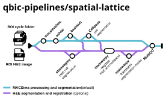

<h1>
  <picture>
    <source media="(prefers-color-scheme: dark)" srcset="docs/images/logo-darkmode.svg">
    
  </picture>
</h1>

[](https://github.com/codespaces/new/nf-core/spatiallattice)
[](https://github.com/nf-core/spatiallattice/actions/workflows/nf-test.yml)
[](https://github.com/nf-core/spatiallattice/actions/workflows/linting.yml)[](https://nf-co.re/spatiallattice/results)[](https://doi.org/10.5281/zenodo.XXXXXXX)
[](https://www.nf-test.com)

[](https://www.nextflow.io/)
[](https://github.com/nf-core/tools/releases/tag/4.0.2)
[](https://www.docker.com/)
[](https://sylabs.io/docs/)

## Introduction

**qbic-pipelines/spatial-lattice** is a bioinformatics pipeline for the processing of multiplexed imaging data generated by the MACSima Imaging Cyclic Immunofluorescence (MACSima) platform, optionally register with corresponding H&E stained tissue sections.

The pipeline takes raw MACSima ROI cycle folders or a complete study (and, optionally, H&E images), stages, converts and optionally performs inetnsity correction of the raw acquisition data with `macsima2mc`, registers the individual tiles into whole-slide images with `ASHLAR`, and performs optional background subtraction, nuclei segmentation with `Cellpose`, and H&E tissue segmentation. It can process either a single ROI at a time or an entire MACSima project folder in batch, automatically extracting the experimental metadata (experiment, rack, well, ROI) from the directory structure. The final output is a set of registered, and optionally segmented whole-slide images together with a MultiQC report summarising the run.



The pipeline consists of the following default steps:

1. Load raw MACSima ROI cycle folders (and optional H&E images) from the samplesheet or project folder.
2. Stage, convert, and correct the raw MACSima acquisition data with [`macsima2mc`](modules/nf-core/mcstaging/macsima2mc/main.nf), producing per-acquisition-group `ome.tif` images and marker sheets.
3. Register the individual tiles into whole-slide images with [`ASHLAR`](modules/nf-core/ashlar/main.nf).
4. Perform background subtraction with [`BACKSUB`](modules/nf-core/backsub/main.nf) (optional, enabled by default).
5. Perform nuclei segmentation with [`CELLPOSE`](modules/nf-core/cellpose/main.nf) (optional, disabled by default).
6. Perform H&E tissue segmentation with [`STAINSEGMY`](modules/qbic/stainsegmy/main.nf) (optional, disabled by default).
7. Collate software versions and generate a [`MultiQC`](modules/nf-core/multiqc/main.nf) report.

## Usage

> [!NOTE]
> If you are new to Nextflow and nf-core, please refer to [this page](https://nf-co.re/docs/get_started/environment_setup/overview) on how to set-up Nextflow. Make sure to [test your setup](https://nf-co.re/docs/get_started/run-your-first-pipeline) with `-profile test` before running the workflow on actual data.

First, prepare a samplesheet with your input data that looks as follows:

`project_samplesheet.csv` (used when `--project` is enabled, the default):

```csv
project,MACSima_project_folder,HnE_folder
PROJECT_1,/path/to/macsima/project/folder,/path/to/hne/folder
```

Each row represents a MACSima project. When `--project` is set, the pipeline walks the project directory structure and automatically extracts the experiment, rack, well, and ROI metadata from the folder hierarchy, so no per-ROI information is required in the samplesheet.

`samplesheet.csv` (used when `--project` is disabled):

```csv
experiment,rack,well,roi,raw_images_ROI,HnE_ROI
EXP_1,R1,A1,ROI1,/path/to/raw/roi/folder,/path/to/hne/roi/file
```

Each row represents a single ROI to be processed. The `raw_images_ROI` column points to the parent folder of the raw MACSima tiles, which contains one or more cycle folders.

Now, you can run the pipeline using:

```bash
nextflow run nf-core/spatiallattice \
   -profile <docker/singularity/.../institute> \
   --input samplesheet.csv \
   --outdir <OUTDIR>
```

> [!WARNING]
> Please provide pipeline parameters via the CLI or Nextflow `-params-file` option. Custom config files including those provided by the `-c` Nextflow option can be used to provide any configuration _**except for parameters**_; see [docs](https://nf-co.re/docs/running/run-pipelines#using-parameter-files).

For more details and further functionality, please refer to the [usage documentation](https://nf-co.re/spatiallattice/usage) and the [parameter documentation](https://nf-co.re/spatiallattice/parameters).

## Pipeline output

To see the results of an example test run with a full size dataset refer to the [results](https://nf-co.re/spatiallattice/results) tab on the nf-core website pipeline page.
For more details about the output files and reports, please refer to the
[output documentation](https://nf-co.re/spatiallattice/output).

## Credits

qbic-pipelines/spatial-lattice was originally written by [Carolin Schwitalla](https://github.com/CaroAMN) in collaboration with [Maximilian Wirth](https://github.com/WirthMax), [Victor Perez](https://github.com/VictorDidier), [Luis Kuhn Cuellar](https://github.com/luiskuhn), and Nadya Panagides.

We thank the following people for their extensive assistance in the development of this pipeline:

[Thusheera Kumarasekara](https://github.com/tckumarasekara)

## Contributions and Support

If you would like to contribute to this pipeline, please see the [contributing guidelines](docs/CONTRIBUTING.md).

For further information or help, don't hesitate to get in touch or open issues.

## Citations

<!-- TODO nf-core: Add citation for pipeline after first release. Uncomment lines below and update Zenodo doi and badge at the top of this file. -->
<!-- If you use nf-core/spatiallattice for your analysis, please cite it using the following doi: [10.5281/zenodo.XXXXXX](https://doi.org/10.5281/zenodo.XXXXXX) -->

<!-- TODO nf-core: Add bibliography of tools and data used in your pipeline -->

An extensive list of references for the tools used by the pipeline can be found in the [`CITATIONS.md`](CITATIONS.md) file.

You can cite the `nf-core` publication as follows:

> **The nf-core framework for community-curated bioinformatics pipelines.**
>
> Philip Ewels, Alexander Peltzer, Sven Fillinger, Harshil Patel, Johannes Alneberg, Andreas Wilm, Maxime Ulysse Garcia, Paolo Di Tommaso & Sven Nahnsen.
>
> _Nat Biotechnol._ 2020 Feb 13. doi: [10.1038/s41587-020-0439-x](https://dx.doi.org/10.1038/s41587-020-0439-x).
